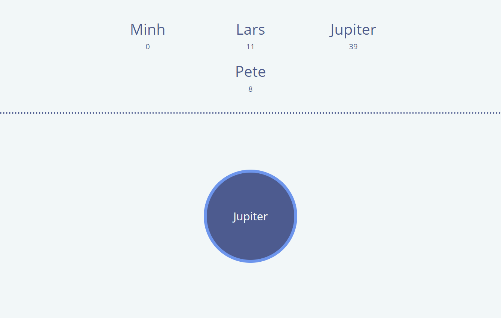

# OverwatchLootbox

## Motivation

Mit Freunden macht alles mehr spaß. Im Onlinespiel Overwatch kann ein Spieler virtuelle Schätze (Lootboxen) sammeln, die zufallsgeneriert Gegenstände enthalten, sobald sie geöffnet werden. So habe ich eine ziemlich große Menge an Lootboxen akkumuliert, um sie alle auf einmal mit meinen Freunden über das Internet zu öffnen. Zusammen mit OverwatchLootbox, einem Daemon und einer Bildschirmübertragung wurde ermöglicht, dass Personen, die auf meinem System gehosteten Webseite verbunden waren, quasi wie eine Fernbedienung Lootboxen zu öffnen.

Dies war ein persönliches Mini-Projekt, um mit Node.js, WebSockets und moderne Web-UX (Animationen) zu experimentieren.

